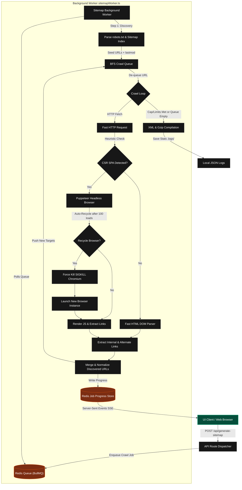

# XML Sitemap Generator

**The easiest way to generate perfect, SEO-optimized XML sitemaps for any website.**

Generate comprehensive, SEO-optimized XML sitemaps for your website with real-time progress tracking, intelligent crawling, and automatic sitemap discovery. This modern web application crawls your website, intelligently detects both SSR and CSR pages, respects robots.txt rules, and merges results from existing sitemaps to ensure 100% coverage.

---

## Features

### Core Capabilities

- **Intelligent Crawling** - Crawls up to 1000 pages per site (configurable from 10-1000).
- **Sitemap Discovery** - Automatically finds and parses existing sitemaps from `robots.txt` or common paths to ensure no page is missed.
- **Hybrid Rendering Support** - Seamlessly handles both Server-Side Rendered (SSR) and Client-Side Rendered (CSR) pages using a scoring-based heuristic model and Puppeteer fallback.
- **Real-time Progress Tracking** - Watch your sitemap being built live with Server-Sent Events (SSE) streaming.
- **Concurrent Processing** - Batch crawling with high-performance concurrency (5 workers for BFS crawl, 10+ for sitemap URL verification).
- **Smart Link Extraction** - Extracts internal links, canonicals, and alternate links while avoiding non-HTML resources.
- **Google Image Schema Support** - Automatically parses images from standard DOM, shadow DOM, and `srcset` attributes, compiling them into a Google-compliant XML image sitemap.
- **Sitemap Splitting & Pagination** - Automatically splits large sitemaps (> 50,000 URLs) into a sitemap index and smaller XML chunk files.
- **HEAD-only Verification** - Sitemap-discovered URLs are verified with lightweight HEAD requests to check indexability without downloading the full page body.

### Ethical & Compliant

- **robots.txt Compliance** - Automatically fetches and rigorously respects disallow rules from your site's robots.txt based on RFC 9309 standards (wildcards, Allow directives, longest-match semantics).
- **Priority-based Sitemap** - Assigns priority values based on page depth (1.0 for homepage, decreasing by 0.1 per level).
- **Standards Compliant** - Generates XML sitemaps fully compliant with the Sitemaps.org protocol.
- **lastmod Propagation** - Preserves `<lastmod>` dates from existing sitemaps, falling back to HTTP `Last-Modified` headers when unavailable.

### Path Filtering

- **Exclude Patterns** - Configurable path exclusion rules to skip tag, category, archive, author, and paginated pages by default.
- **Per-hostname Timeouts** - Override request timeouts for specific domains via environment variable to handle slow or rate-limited targets.
- **SSRF Protection** - Blocks private/internal IP addresses to prevent server-side request forgery.

### Insights & Crawl History

- **Detailed Statistics** - Provides a comprehensive breakdown of discovered pages, crawl depth, and errors.
- **Crawl History Dashboard** - View details of your recent crawls directly in the UI dashboard, fetching logs dynamically.
- **JSON Logs** - Automatically saves generation stats to the `.logs/` directory for every run, including a `latest.json` for quick access.
- **Visual Summary** - Beautiful CLI-style box summary showing the health and outcome of every sitemap generation.

### Modern User Experience

- **Minimalist UI** - Sleek, dark-themed design built with Next.js and Tailwind CSS.
- **Live Feedback** - Real-time progress indicator showing current URL and running page count.
- **One-Click Download** - Instant sitemap.xml and compressed sitemap.xml.gz download with robots.txt deployment instructions.

---

## Technology Stack

- **[Next.js](https://nextjs.org/)** `16.x` - Web framework (App Router)
- **[TypeScript](https://www.typescriptlang.org/)** `6.x` - Type safety
- **[BullMQ](https://bullmq.io/)** - High-performance background job queue
- **[Redis](https://redis.io/)** - In-memory data store for the BullMQ queue
- **[Puppeteer](https://pptr.dev/)** - Headless Chrome for CSR execution
- **[Axios](https://axios-http.com/)** - High-speed HTTP client with retry logic
- **[node-html-parser](https://github.com/taoqf/node-html-parser)** - Fast HTML DOM parsing
- **[Tailwind CSS](https://tailwindcss.com/)** `4.x` - Modern component styling
- **[Framer Motion](https://www.framer.com/motion/)** - Fluent animations & transitions

---

## Getting Started

### Prerequisites

- Node.js 18+
- Redis Server (running on `127.0.0.1:6379`)
- [pnpm](https://pnpm.io/) (recommended)

### Installation

1. Clone the repository:

   ```sh
   git clone https://github.com/atharvdange618/xml-sitemap-generator.git
   cd xml-sitemap-generator
   ```

2. Install dependencies:

   ```sh
   pnpm install
   ```

### Running Locally

1. Ensure your Redis server is running locally.

2. Start the background sitemap worker:

   ```sh
   pnpm worker
   ```

3. Start the Next.js development server in a separate terminal:

   ```sh
   pnpm dev
   ```

Visit [http://localhost:3000](http://localhost:3000) in your browser.

### Building for Production

Compile and run type checks:

```sh
pnpm build
pnpm start
```

---

## How It Works

This application uses a multi-stage **asynchronous queue and crawling engine**:



1. **Queueing**: When a crawl request is submitted via the UI or API, the request is added as a job to a BullMQ queue backed by Redis.
2. **Crawl Worker**: A dedicated background worker pulls the job from the queue and initiates the crawl:
   - **Sitemap Discovery**: First checks `robots.txt` for existing sitemaps and common locations. Found URLs are parsed along with their `<lastmod>` dates and added to the initial set.
   - **Intelligent Crawling**:
     - **HTTP Phase**: First attempts a fast HTTP request to fetch content and extract links.
     - **CSR Detection**: Uses a scoring-based heuristic model -- evaluates visible text density, framework root selectors (`#root`, `#app`, `#__next`, etc.), splash screen presence, and hydration markers. Pages scoring >= 3 are routed to Puppeteer.
     - **Puppeteer Phase**: If CSR is detected, renders the page in a headless browser to extract dynamically generated links from the fully rendered DOM.
3. **Merging & Metadata**: Combines URLs from existing sitemaps and the fresh crawl. Sitemap-provided `lastmod` dates are propagated to avoid redundant re-fetches; HEAD-only requests verify indexability of sitemap-discovered URLs. `priority` is calculated for every unique page.
4. **Streaming**: Progress is saved to Redis and streamed via Server-Sent Events (SSE) to provide real-time updates in the UI.

### Stability & Security Features

- **Windows CFG Bypass**: Bypasses Control Flow Guard crashes on Windows by running the TypeScript runner with the `--no-maglev` flag.
- **Asynchronous Browser Pooling**: Prevents resource/handle leaks by automatically recycling the headless Chromium instance in the background after every 100 page loads, ensuring active page threads are never interrupted.
- **Zombie Process Protection**: Force-kills (`SIGKILL`) Chromium processes during browser recycles and job completions to prevent memory leaks and zombie processes from accumulating.
- **Graceful Worker Shutdown**: Handles `SIGTERM` and `SIGINT` signals to cleanly close the BullMQ worker and release resources.
- **AbortController Job Timeout**: Each crawl job has a 10-minute timeout via `AbortController` to prevent runaway crawls from blocking the worker pool.
- **Worker Lock Optimization**: Uses extended BullMQ lock duration (180s) to prevent false stalling reports when processing CPU-heavy HTML parsing tasks.

---

## Configuration

Fine-tune the crawler engine in [`src/utils/sitemap/config.ts`](src/utils/sitemap/config.ts):

```typescript
export const config: CrawlerConfig = {
  csr: {
    minimalContentLength: 200,
    minimalChildNodes: 5,
    scriptCountThreshold: 10,
    contentScriptRatio: 1000,
    rootSelectors: ["#root", "#__next", "#app", "#__nuxt", "[ng-version]"],
  },
  puppeteer: {
    waitForSelectorsTimeout: 8000,
    gotoTimeout: 15000,
    waitUntil: "domcontentloaded",
  },
  logging: { verbose: true },
  maxDepth: 10,
  concurrency: 5,
  defaultTimeout: 15000,
  robotsTxtTimeout: 30000,
  timeoutOverrides: parseTimeoutOverrides(),
  pathExcludePatterns: parsePathExcludePatterns(),
};
```

| Option | Default | Description |
|---|---|---|
| `concurrency` | `5` | Number of concurrent workers for BFS page crawling |
| `maxDepth` | `10` | Maximum link depth from the homepage before stopping |
| `defaultTimeout` | `15000` | Default HTTP request timeout in milliseconds |
| `robotsTxtTimeout` | `30000` | Timeout for fetching robots.txt (longer to handle slow servers) |
| `timeoutOverrides` | `{}` | Per-hostname timeout overrides (env: `SITEMAP_TIMEOUT_OVERRIDES`) |
| `pathExcludePatterns` | tag/category/archive patterns | Paths to exclude from crawling (env: `SITEMAP_EXCLUDE_PATTERNS`) |
| `puppeteer.waitUntil` | `"domcontentloaded"` | Browser navigation wait strategy |

### Environment Variables

| Variable | Description |
|---|---|
| `SITEMAP_TIMEOUT_OVERRIDES` | JSON object mapping hostnames to timeout values in ms (e.g. `{"slow-site.com": 30000}`) |
| `SITEMAP_EXCLUDE_PATTERNS` | Comma-separated path patterns to exclude (e.g. `/tag/,/archive/,?page=`) |
| `SITEMAP_WORKER_CONCURRENCY` | Number of BullMQ worker threads (default: `2`) |

---

## Project Structure

```text
xml-sitemap-generator/
├── src/
│   ├── app/
│   │   ├── api/
│   │   │   ├── generate-sitemap/
│   │   │   │   ├── download/
│   │   │   │   │   └── route.ts   # Gzip/XML download endpoint (TS)
│   │   │   │   ├── status/
│   │   │   │   │   └── route.ts   # SSE status listener endpoint (TS)
│   │   │   │   └── route.ts       # Job queue dispatcher endpoint (TS)
│   │   │   └── logs/
│   │   │       └── route.ts       # Stats retrieval endpoint (TS)
│   │   ├── layout.tsx             # Root layout (TSX)
│   │   └── page.tsx               # Main UI & history log panel (TSX)
│   ├── types/
│   │   ├── declarations.d.ts      # Global types (CSS, modules)
│   │   └── sitemap.ts             # Shared sitemap/crawling interfaces
│   ├── utils/
│   │   ├── sitemap/               # Crawler engine details (TS)
│   │   │   ├── cache.ts           # Crawl cache (ETags, Last-Modified, render decisions)
│   │   │   ├── config.ts          # Crawler configuration & env parsing
│   │   │   ├── crawler.ts         # BFS crawl, CSR detection, Puppeteer fallback
│   │   │   ├── httpClient.ts      # Axios client with retry, HEAD support, redirect loop detection
│   │   │   ├── index.ts           # Public API barrel export
│   │   │   ├── parser.ts          # Sitemap XML parsing, discovery, generation
│   │   │   ├── queue.ts           # BullMQ queue helper (TS)
│   │   │   ├── redis.ts           # Redis connection configuration (TS)
│   │   │   ├── robots.ts          # robots.txt parsing (RFC 9309)
│   │   │   └── urlUtils.ts        # URL normalization, validation, SSRF protection
│   │   ├── sitemapGenerator.ts    # Crawler entry point wrapper (TS)
│   │   └── statsLogger.ts         # Run logging & stats compiler (TS)
│   └── workers/
│       └── sitemapWorker.ts       # BullMQ queue consumer background worker (TS)
├── .logs/                         # Auto-generated JSON crawl logs
├── tsconfig.json                  # TS compiler config
└── README.md
```

---

## License

MIT
